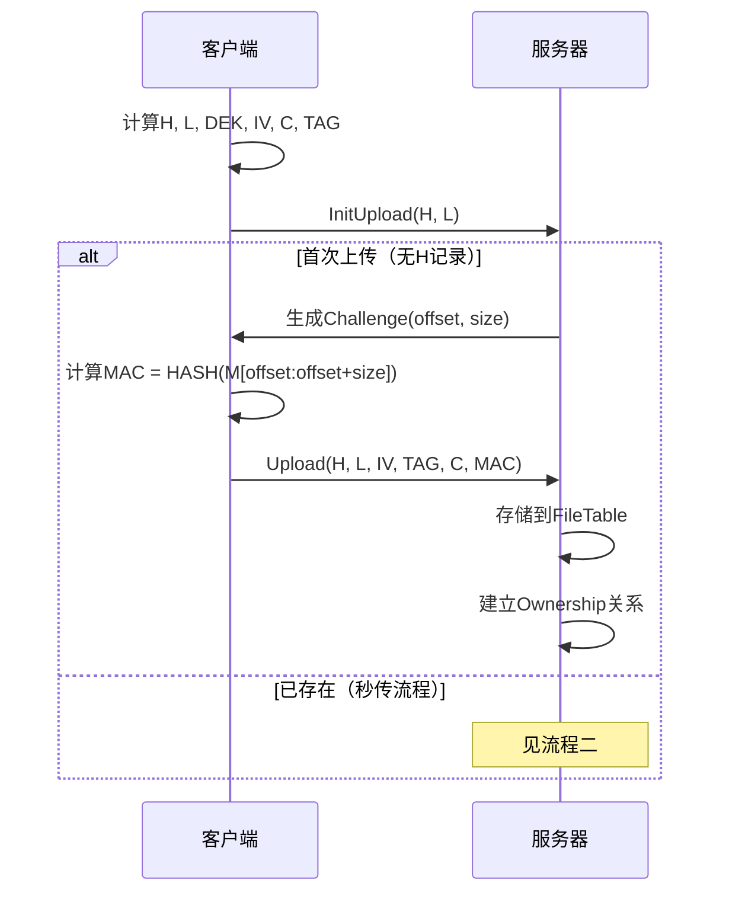
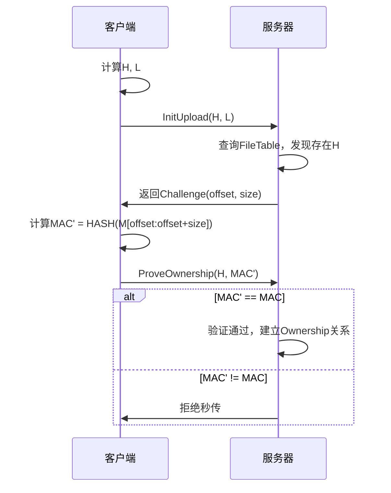
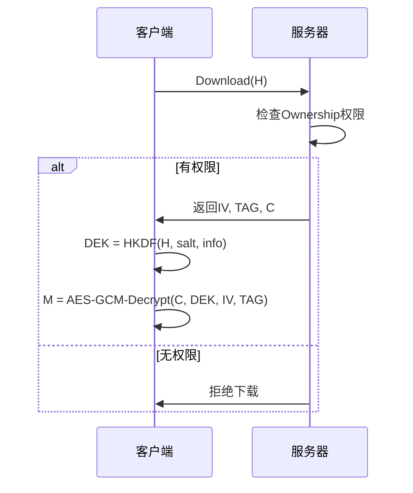

# 云端加密去重存储系统架构文档

## 系统概述

这是一个基于收敛加密（Convergent Encryption）的云端存储系统，核心目标是：
1. **服务器只存储密文，不存储明文**
2. **实现相同文件内容的去重存储（秒传功能）**
3. **通过PoW（Proof of Ownership）机制确保用户确实拥有文件**

## 威胁模型

### 防护对象
- **好奇但诚实的服务器（honest-but-curious）**：不篡改数据，但想窥视内容
- **恶意用户伪造上传**：试图通过伪造上传获取他人密文

### 不防护对象
- **数据库被完全攻破**：当H（文件哈希）和C（密文）全部泄露时，攻击者可通过DEK = HKDF(H)解密获得明文

## 核心技术架构

### 1. 客户端密钥生成与加密

```plaintext
文件明文 M
    ↓
H = HASH(M) [SHA-256]
L = len(M)
    ↓
DEK = HKDF(
    ikm = H,
    salt = "lab-key-derivation",    // 固定常量
    info = "file-encryption-v1"     // 固定常量
)
    ↓
IV = Random(96 bits)
C, TAG = AES-GCM-Encrypt(M, DEK, IV)
```

**关键特性**：相同文件内容 → 相同H → 相同DEK，实现去重基础

### 2. 服务器数据库设计

#### 文件表（FileTable） - 按H去重
| 字段 | 含义 |
|------|------|
| H | 文件哈希（主键） |
| L | 文件长度 |
| IV | AES-GCM初始化向量 |
| TAG | AES-GCM认证标签 |
| C | 密文 |
| offset | PoW片段起始偏移 |
| size | PoW片段长度 |
| MAC | HASH(M[offset : offset+size]) |

#### 用户-文件关系表（OwnershipTable）
| 字段 | 含义 |
|------|------|
| user_id | 用户标识 |
| H | 文件哈希 |
| created_at | 建立关系时间 |

## 核心业务流程

### 流程一：首次上传



### 流程二：秒传/去重上传



### 流程三：文件下载



## 安全机制分析

### PoW（Proof of Ownership）机制

**作用**：
- 防止仅知道H的攻击者骗取密文
- 防止恶意用户伪造"秒传"请求

**实现原理**：
- 服务器随机选择文件片段位置(offset, size)
- 客户端必须计算该片段的MAC = HASH(M[offset:offset+size])
- 只有真正拥有完整文件M的用户才能正确计算MAC

**局限性**：
- 不防护数据库完全泄露
- 当H和C同时泄露时，攻击者可直接计算DEK解密

### 收敛加密的固有限制

**优势**：
- 实现去重存储
- 服务器无法窥视明文内容
- 相同文件自动产生相同密文

**劣势**：
- 易受频率分析攻击（可通过H值频率推断文件流行度）
- 数据库泄露时安全性完全丧失
- 无法提供前向安全性

## 系统安全假设

本系统基于以下安全假设：
1. **服务器端数据库不会被完全攻破**
2. **HKDF和AES-GCM算法本身是安全的**
3. **客户端环境是可信的**
4. **用户能妥善保管自己的文件**

## 实现注意事项

### 客户端实现要点
- 必须使用加密安全的随机数生成器生成IV
- HKDF参数必须严格固定
- AES-GCM需要正确处理认证标签验证

### 服务器实现要点
- offset生成应使用密码学安全的PRNG
- PoW片段大小需要在安全性和性能间平衡
- 需要实现完善的权限检查机制

### 性能考虑
- 大文件处理需要流式计算
- PoW验证需要优化数据库查询
- 密钥派生可能成为性能瓶颈

## 总结

这是一个在特定威胁模型下相对安全的云端存储方案。通过收敛加密实现去重，通过PoW机制实现访问控制。在"服务器不被攻破"的前提下，能够有效保护用户隐私，但需要接受收敛加密固有的安全限制。